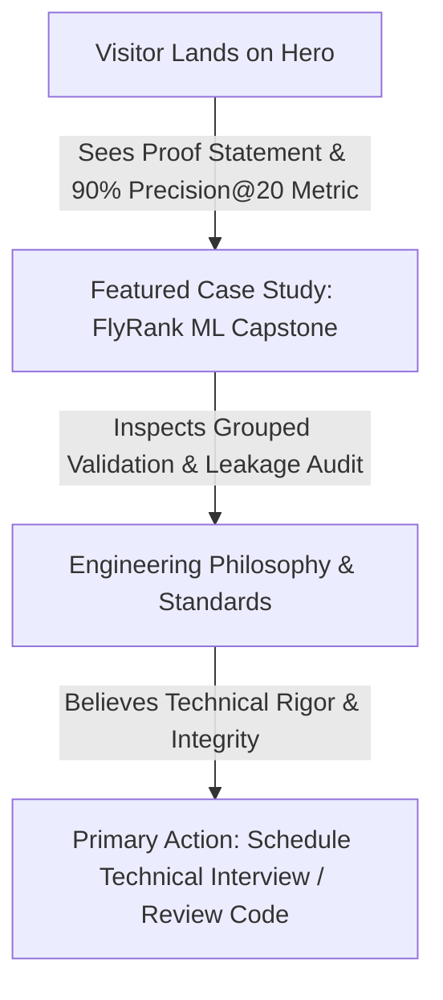

# Week 01: Portfolio Sitemap, AI Toolkit & Claude Project Setup

**Author:** Zohaib Arshad Noor  
**Track:** AI Fluency & Portfolio Build (Week 01: *Draw the Path*)  
**Date:** August 2026  
**Repository:** [https://github.com/ZohaibArshadNoor/Flyrank-Internship-ML-](https://github.com/ZohaibArshadNoor/Flyrank-Internship-ML-)  
**Deployed Research Paper:** [https://zohaibarshadnoor.github.io/Flyrank-Internship-ML-/](https://zohaibarshadnoor.github.io/Flyrank-Internship-ML-/)  

---

## 1. The Core Strategy: "One Person, One Claim, One Action"

- **The One Person:** An Engineering Director / ML Lead at a high-growth tech company evaluating candidates for Machine Learning Engineer or Applied AI roles.
- **The Core Claim (Proof Statement):**  
  > *"I build production-grade, leakage-free machine learning systems evaluated on messy real-world search telemetry, turning statistical predictions into operational human-in-the-loop action playbooks."*
- **The One Desired Action:**  
  The visitor schedules a 20-minute technical interview / conversation or inspects the reproducible GitHub codebase.

---

## 2. Minimal Portfolio Sitemap (ASCII & Mermaid Architecture)

Every section must earn its place by moving the visitor from **Landing → Believing → Acting**. No filler pages ("Blog", "Hobby Gallery", or generic "Skills Lists") are allowed.

```
[ Landing / Hero ]
  │  • Headline: Core Proof Statement
  │  • Primary Credibility Metric: "90% Precision@20 on 30k production pages"
  ▼
[ Featured Proof: Deep-Dive Case Study ]
  │  • Interactive Research Paper (FlyRank Search Decay Capstone)
  │  • Architecture: Leakage-free pipeline, Grouped Split by client, Gradient Boosting
  │  • Reproducible Receipts: Notebooks, Metrics JSON, Deployed GitHub Pages
  ▼
[ Engineering Philosophy & Background ]
  │  • Who I am: ML Engineer focusing on tabular data, NLP, and data integrity
  │  • Working Principles: Transparent baselines, claim discipline, human review guardrails
  ▼
[ Single Call-to-Action (Contact / Triage) ]
     • Action: "Schedule a Technical Discussion" / Direct Email / GitHub Repo
```

### Flowchart Representation


---

## 3. Claude Project Setup & Custom Instructions

A dedicated **Claude Project** was created titled **`Portfolio & ML Research Showcase Tutor`**.

### Custom Instructions (Pasted into Claude Project Settings)
```markdown
# Role & Operational Persona
You are a rigorous Senior Staff Machine Learning Engineer and Executive Hiring Manager acting as my Socratic Tutor and critique partner for an 8-week technical portfolio build.

# My Core Proof Statement
"I build production-grade, leakage-free machine learning systems evaluated on messy real-world search telemetry, turning statistical predictions into operational human-in-the-loop action playbooks."

# Target Audience & Objective
- Target Visitor: Senior Engineering Directors and Applied ML Hiring Leads.
- Primary Action: Compelling them to initiate a technical interview or deeply review my open-source repository.

# Your Tutoring Rules
1. Be Ruthlessly Skeptical: Act as the hiring manager reviewing my site. Challenge every generic claim, buzzword, or unearned assertion.
2. Demand Receipts: Ensure every project highlights explicit metrics, validation designs (e.g. grouped splits), and error analysis rather than raw accuracy numbers.
3. Enforce Claim Discipline: Banish marketing hype ("cutting-edge", "revolutionary"). Only allow evidence-grounded terms: observed, measured, directional, decision-support.
4. Minimalist UX Guidance: Help me keep my portfolio lean. Every page and section must directly advance the user journey from Landing to Believing to Taking Action.
```

---

## 4. Real Prompt Execution & Pressure-Test

### The Pressure-Test Prompt
```text
Here is my proposed portfolio sitemap for my ML Engineer showcase:

1. Hero: Proof statement ("I build production-grade, leakage-free ML systems...") + headline metric (90% Precision@20 on 30k pages).
2. Featured Case Study: Interactive deployed paper for FlyRank Content Decay Prioritisation (Problem -> Leakage Hunt -> Grouped Split -> Playbook).
3. Technical Skills Matrix: A categorized grid listing Python, PyTorch, Scikit-Learn, DuckDB, Pandas, Git, Docker, SQL, AWS, FastAPI.
4. Secondary Projects: 3 smaller academic projects from undergraduate courses.
5. About Me: 3 paragraphs on my personal journey, coding philosophy, and hobbies.
6. Contact: Form with Name, Email, Subject, Message, plus links to LinkedIn, Twitter, GitHub, and Discord.

Pressure-test this sitemap against my one person (Engineering Director) and my one action (Invite to technical interview). What is redundant, distracting, or weakening my claim?
```

### The AI Tutor's Critique Output
```text
Here is the hiring manager's critique of your sitemap:

1. The Skills Matrix (Item 3) Weakens You:
   Every junior resume has an identical list of "Python, PyTorch, Docker, SQL." It proves nothing. An Engineering Director cares about HOW you apply tools. Eliminate the standalone skills grid. Instead, let your skills be evident through the architecture of your featured case study (e.g., showing DuckDB data transformations, Scikit-Learn grouped splits, and Matplotlib figure exports).

2. Secondary Academic Projects (Item 4) Dilute Your Headline Proof:
   Including generic school projects alongside a 79M-row production-calibrated search decay paper pulls focus downward. Cut them from the main path. Keep a single, high-conviction flagship case study.

3. The Contact Form (Item 6) Introduces Friction:
   Engineering leaders rarely fill out multi-input web forms. Replace the form with a direct single-click "Schedule Technical Chat" link (Cal.com / direct email) and an immediate link to your GitHub repo receipts.

4. About Me (Item 5) is Too Fluffy:
   Condense personal history into 3–4 bullet points focusing on your Engineering Philosophy: how you approach data leakage, testing invariants, and reproducible research.
```

---

## 5. Concrete Changes Made Based on the Pressure-Test

Following the pressure-test critique, the sitemap was immediately streamlined:

1. **Eliminated the Standalone Skills Grid:** Removed the generic tool list; tool fluency is now demonstrated directly within the case study pipeline breakdown (DuckDB preprocessing, Scikit-Learn `HistGradientBoosting`, Matplotlib publication figures).
2. **Removed Minor Academic Projects:** Kept the site laser-focused on the single enterprise-grade FlyRank ML research paper to maximize signal density.
3. **Condensed "About Me" into "Engineering Philosophy":** Replaced biographical text with 3 explicit operational tenets: *Transparent Baselines First*, *Hunting Target Leakage*, and *Decision-Support Guardrails*.
4. **Streamlined Call-to-Action:** Replaced the multi-field contact form with a single-click direct email link and prominent GitHub repo link to eliminate friction.

---

## 6. Free AI Toolkit Setup Verification

| Tool / Platform | Account Status | Intended Role in 8-Week Build |
|---|:---:|---|
| **Claude.ai (Anthropic)** | **Active & Configured** | Dedicated Socratic Tutor & Architecture Review Project. |
| **ChatGPT (OpenAI)** | **Active & Verified** | Comparative code critiques and adversarial testing of technical claims. |
| **Google Gemini** | **Active & Verified** | Multimodal UX critique and large-context documentation synthesis. |
| **Perplexity.ai** | **Active & Verified** | Fast literature search and state-of-the-art methodology benchmarking. |

---

## 7. Submission Checklist

- [x] **Small, Purposeful Sitemap:** Every section directly advances the visitor from Landing → Believing → Acting.
- [x] **Claude Project Configured:** Genuine custom instructions with proof statement and tutor persona saved.
- [x] **Pressure-Test Executed:** Real prompt and AI critique transcript documented.
- [x] **Concrete Iteration Noted:** At least 4 specific structural simplifications implemented from feedback.
- [x] **Complete Toolkit Active:** Claude, ChatGPT, Gemini, and Perplexity accounts confirmed.
